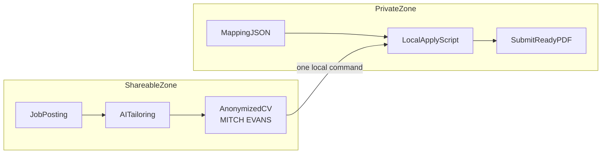

# Reveal CV

Privacy-first CV tailoring where AI never learns your real identity.

This repository packages a local-first job application workflow around one core idea: **tailor in public, reveal in private**. The AI works on anonymized CV content inside the repo, while your real name, email, links, photo, and deanonymized PDFs stay outside the project in `~/private/cv/`.

## Why it exists

Most CV tools ask you to upload your full resume to a cloud service, then keep your personal details on their servers. This project takes the opposite approach:

- The tailoring workflow runs on placeholders such as `MITCH EVANS`, fictional employers, and `cv-placeholder` URLs.
- Your private mapping file lives only in `~/private/cv/cv_identity_mapping.json`.
- One local command reveals the final application-ready files on your machine.



## Three-step workflow

```text
1. Setup once     -> private_cv setup + fill mapping (5 min)
2. Tailor a role  -> save job .txt -> run_cv_tailoring -> run_agent_pipeline
3. Reveal & send  -> ~/private/cv/cv apply <run_id>
```

## Try the fictional demo first

The fastest way to understand the privacy model is to run the demo. It uses the fictional candidate **ALEX RIVERA**, requires no API keys, and never touches real PII.

```bash
cd /path/to/reveal-cv   # repository root
python3 -m venv .venv
source .venv/bin/activate
pip install -r requirements.txt

.venv/bin/python scripts/run_demo.py
.venv/bin/python scripts/run_demo.py --assemble
.venv/bin/python scripts/run_demo.py --pdf
```

Walkthrough: [`docs/DEMO.md`](docs/DEMO.md)  
60-second script: [`docs/DEMO_VIDEO_SCRIPT.md`](docs/DEMO_VIDEO_SCRIPT.md)  
Sample run: [`cv_generation/demo/`](cv_generation/demo/)  
Privacy FAQ: [`PRIVACY.md`](PRIVACY.md)  
Launch post draft: [`docs/SHOW_HN.md`](docs/SHOW_HN.md)

## Quickstart with your real workflow

### 1. Setup once

```bash
cd /path/to/reveal-cv   # repository root
python3 -m venv .venv
source .venv/bin/activate
pip install -r requirements.txt

.venv/bin/python -m cv_generation.private_cv setup
.venv/bin/python -m cv_generation.private_cv edit
```

`setup` creates `~/private/cv/`, copies the example mapping, and installs the `~/private/cv/cv` shortcut. Edit only `~/private/cv/cv_identity_mapping.json`.

### 2. Tailor a role

Save a job posting as plain text, then create a run workspace and execute the pipeline:

```bash
.venv/bin/python -m cv_generation.run_cv_tailoring \
  --job-file cv_generation/jobs/finn_465089104_ml_ai_engineer.txt

.venv/bin/python -m cv_generation.run_agent_pipeline \
  --run-dir cv_generation/cv_runs/<run_id> \
  --provider cursor
```

Alternative providers and the manual JSON workflow are documented in [`cv_generation/CV_AUTOMATION.md`](cv_generation/CV_AUTOMATION.md).

### 3. Reveal privately

```bash
~/private/cv/cv apply <run_id>
```

This deanonymizes `final_cv.md` and any supplementary documents present in the run, then writes the real-name markdown and PDFs to `~/private/cv/deanonymized/<run_id>/`.

## What the AI sees and what stays private

| Question | Answer |
|----------|--------|
| Does the AI see my real name or email? | No. The repo-side workflow uses anonymized placeholders. |
| Does any private file live in git? | No. Real mapping data, photos, and deanonymized output stay in `~/private/cv/`. |
| Does any data leave my machine at all? | Anonymized career content still goes to whichever provider you choose for AI generation. This is identity separation, not a zero-data claim. |
| Can I try it without real data? | Yes. Use the committed ALEX RIVERA demo first. |

More detail: [`PRIVACY.md`](PRIVACY.md) and [`docs/GIT_AND_PRIVACY.md`](docs/GIT_AND_PRIVACY.md).

## Two modules in one repo

| Folder | Purpose |
|--------|---------|
| [`cv_generation/`](cv_generation/) | Portable CV tailoring, PDF render, private deanonymize |
| [`job_search/`](job_search/) | Norway-first NAV ingest, SQLite scoring, Streamlit dashboard |
| [`shared/`](shared/) | Demo CVs plus local CV source loading |

The privacy-first CV workflow is the main product story. The job search stack is a **Norway reference module** built around NAV and Rogaland-oriented ranking. The tailoring core works on any pasted job posting text.

## Norway today, other locales later

This repo is currently strongest in a Norwegian job-search context:

- `job_search/` integrates with NAV and includes Norway-specific ranking signals.
- `cv_generation/` can localize output to Norwegian with `final_cv_no.md` and `cover_letter_no.md`.
- The core tailoring pipeline itself is locale-agnostic as long as you provide a job posting `.txt`.

That means the product can honestly be marketed as **built for Norway first, expandable elsewhere** rather than as a Norway-only tool.

## Job search module

If you want the full Norway workflow, see [`job_search/JOB_SEARCH.md`](job_search/JOB_SEARCH.md).

```bash
.venv/bin/python -m job_search.ingest_nav_jobs
.venv/bin/python -m job_search.score_jobs
.venv/bin/python scripts/run_job_search_cycle.py
.venv/bin/streamlit run job_search/dashboard.py
```

## Agent providers

```bash
.venv/bin/python -m cv_generation.generate_cv_with_cursor --run-dir cv_generation/cv_runs/<id> --provider cursor
.venv/bin/python -m cv_generation.generate_cv_with_cursor --run-dir cv_generation/cv_runs/<id> --provider anthropic --model claude-sonnet-4-20250514
```

## Before pushing to git

```bash
.venv/bin/python scripts/check_safe_to_push.py
```

See [`docs/GIT_AND_PRIVACY.md`](docs/GIT_AND_PRIVACY.md). Real CV data and identity files should never be committed.

## Agent boundary

See [`AGENTS.md`](AGENTS.md). Agents stay inside the repo and must not read `~/private/cv/`.
