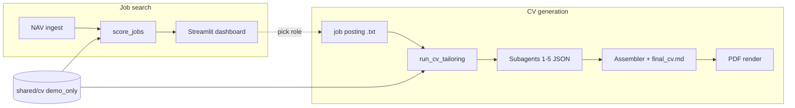

# Demo walkthrough

Use this guide to **show the process** without real PII or API keys. Everything uses the fictional candidate **ALEX RIVERA** and employer **Northline Labs**.

If you need a short public-facing recording, use [`docs/DEMO_VIDEO_SCRIPT.md`](DEMO_VIDEO_SCRIPT.md). It is designed for a 60-second capture that ends on the privacy claim: your real name never appeared in the repo or AI workflow.

## Architecture (one repo)



## What is committed vs local

| Safe in git | Stays on your machine |
|-------------|------------------------|
| `shared/cv/*.demo.md`, `demo_only/` | `shared/cv/industry.md`, `academic.md` (gitignored) |
| `cv_generation/demo/` | `cv_generation/cv_runs/` |
| `cv_generation/jobs/demo_*.txt` | Real mapping in `~/private/cv/` |
| `scripts/run_demo.py` | `final_cv.pdf` (gitignored) |

## 5-minute live demo (CV path)

### 0. Setup (once)

```bash
cd "/path/to/job search automation"
python3 -m venv .venv && source .venv/bin/activate
pip install -r requirements.txt
```

### 1. Show the fictional source CV

```bash
export CV_SOURCE_DIR="$(pwd)/shared/cv/demo_only"
.venv/bin/python -m shared.cv_loader
```

Open `shared/cv/demo_only/industry.md` — note the `DEMO CV` banner and `demo.candidate@example.com`.

### 2. Show the job posting

Open `cv_generation/jobs/demo_northline_ml_engineer.txt` (Northline Labs, ML Engineer).

### 3. Run the demo script

```bash
.venv/bin/python scripts/run_demo.py
```

This prints the pipeline map and checks the sample run under `cv_generation/demo/northline_ml_engineer/`.

Rebuild the final markdown (deterministic, **no LLM**):

```bash
.venv/bin/python scripts/run_demo.py --assemble
```

Optional PDF for screen share:

```bash
.venv/bin/python scripts/run_demo.py --pdf
open cv_generation/demo/northline_ml_engineer/final_cv.pdf
```

### 4. Walk through the run folder

Open these in order and explain each step:

| File | What it shows |
|------|----------------|
| `job_posting.txt` | Raw input |
| `01_jd_parser_output.json` | Structured role + skills |
| `02_keyword_ranker_output.json` | ATS keyword priorities |
| `03_track_selector_output.json` | Industry vs academic choice |
| `04_bullet_tailor_output.json` | Truthful bullet rewrites (optional apply) |
| `05_ats_checker_output.json` | Coverage score + gaps |
| `06_assembler_output.json` | Programmatic merge metadata |
| `final_cv.md` | Application-ready markdown |
| `cover_letter.md` | Example letter (manual / separate step today) |

**Talking point:** `final_cv.md` keeps all roles and sections from the source CV; the assembler adds `## Role` from the job title (`ML ENGINEER`). Agent bullets in `04_*` are optional unless you pass `--apply-tailored-bullets`.

### 5. Agent providers (when you have keys)

For a **live** run with LLMs, create a new workspace:

```bash
export CV_SOURCE_DIR="$(pwd)/shared/cv/demo_only"
.venv/bin/python -m cv_generation.run_cv_tailoring \
  --job-file cv_generation/jobs/demo_northline_ml_engineer.txt \
  --company "Northline Labs" --role "ML Engineer"

.venv/bin/python -m cv_generation.generate_cv_with_cursor \
  --run-dir cv_generation/cv_runs/<new_folder> \
  --provider cursor    # or anthropic | openai | manual
```

`manual` writes `*_prompt.txt`; you paste JSON into `*_output.manual.json`.

### 6. Private deanonymize (your real workflow)

Not part of the public demo. With your real CV and `~/private/cv/cv_identity_mapping.json`:

```bash
~/private/cv/cv apply <run_id>
```

**Talking point:** the demo deliberately stops before this step. Public audiences should see that the repo workflow is anonymized first, and that revealing a real identity happens later on the user's own machine.

## Job search demo (optional, ~2 min)

Uses the same demo CV keywords for scoring:

```bash
export CV_SOURCE_DIR="$(pwd)/shared/cv/demo_only"
.venv/bin/python -m job_search.ingest_nav_jobs --since-days 7 --max-pages 1
.venv/bin/python -m job_search.score_jobs --track industry --print-top 5
.venv/bin/streamlit run job_search/dashboard.py
```

Requires network for NAV. DB stays in `job_search/data/` (gitignored).

This module is Norway-specific today. The CV generation flow above is the portable core; NAV ingest is the first locale-specific adapter.

## Refresh the committed sample run

```bash
.venv/bin/python scripts/run_demo.py --prepare --force
```

Re-creates tasks, re-seeds JSON from `cv_generation/demo/seed/`, and rebuilds `final_cv.md`.

## Presenter checklist

- [ ] Terminal font size readable for audience  
- [ ] `CV_SOURCE_DIR` points at `demo_only` (not your real `industry.md`)  
- [ ] Open `final_cv.md` and `03_track_selector_output.json` side by side  
- [ ] Mention git safety: `scripts/check_safe_to_push.py` before push  
